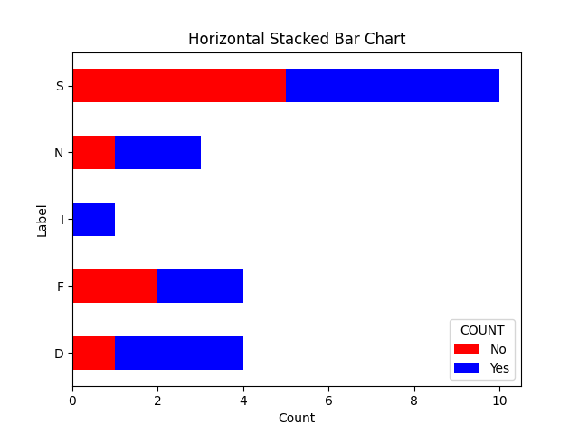
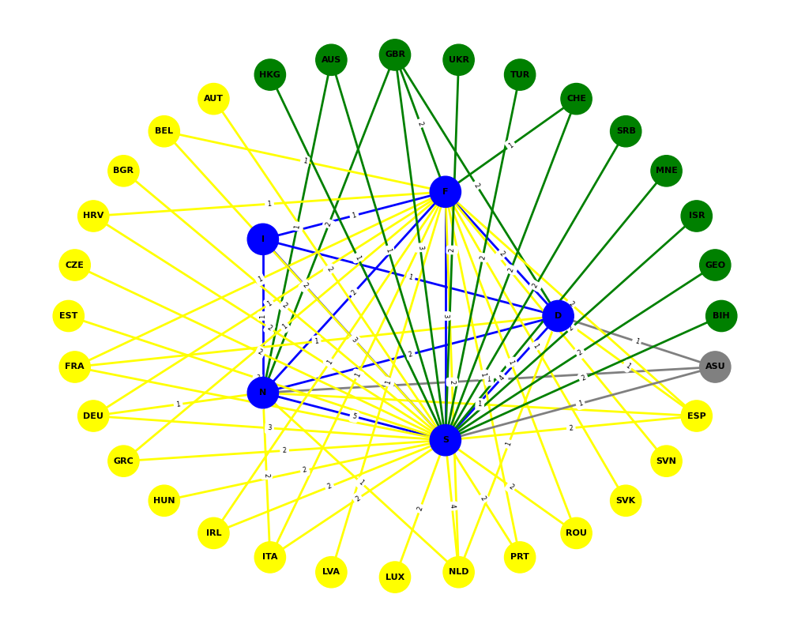
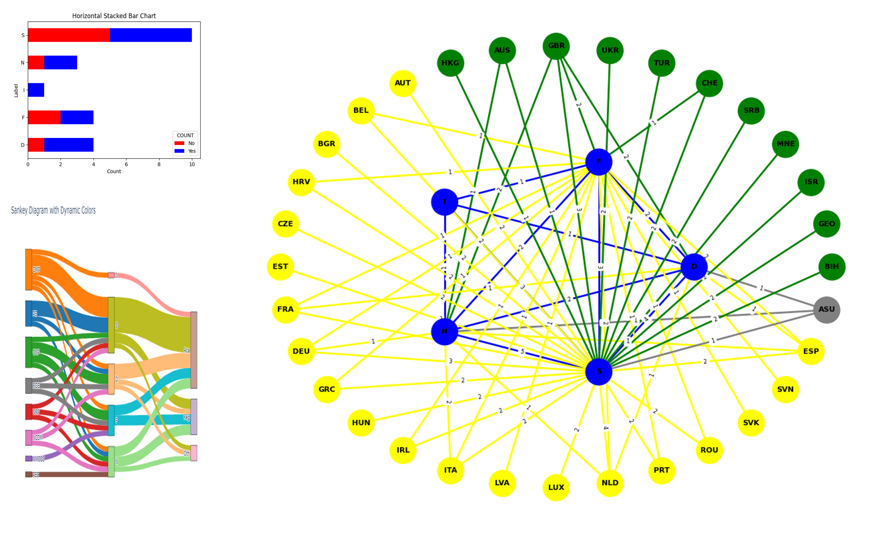

# Data Visualizations

## 1. Bar Graph

```python
import pandas as pd
import matplotlib.pyplot as plt

# Read data
bar_data = pd.read_csv('bar_assignment.csv')
bar_data['COUNT'] = bar_data['COUNT'].map({1: 'Yes', 0: 'No'})
bar_grouped = bar_data.groupby(['LABEL', 'COUNT']).size().unstack(fill_value=0)

# Plot with specified colors
colors = {'Yes': 'blue', 'No': 'red'}
bar_grouped.plot(kind='barh', stacked=True, color=[colors[col] for col in bar_grouped.columns])

plt.xlabel('Count')
plt.ylabel('Label')
plt.title('Horizontal Stacked Bar Chart')
plt.savefig('bar_chart.png')
plt.show()
```

### Output:


## 2. Sankey Diagram

```python
import pandas as pd
import plotly.graph_objects as go

# Read data
sankey_data = pd.read_csv('sankey_assignment.csv')
df_prep = sankey_data.melt(id_vars=['LABEL'], var_name='source', value_name='value')
df_prep.rename(columns={'LABEL': 'target'}, inplace=True)
df_prep = df_prep[['source', 'target', 'value']]

# Split the data into layers
df_temp1 = df_prep[:40]
df_temp2 = df_prep[40:]
df_temp2 = df_temp2[['target', 'source', 'value']]
df_temp2.rename(columns={'target': 'source', 'source': 'target'}, inplace=True)

# Combine the layers
links = pd.concat([df_temp1, df_temp2], axis=0)
unique_source_target = list(pd.unique(links[['source', 'target']].values.ravel('K')))
mapping_dict = {k: v for v, k in enumerate(unique_source_target)}
links['source'] = links['source'].map(mapping_dict)
links['target'] = links['target'].map(mapping_dict)

# Define colors
hex_colors = ["#1f77b4", "#ff7f0e", "#2ca02c", "#d62728", "#9467bd", "#8c564b", "#e377c2"]
node_colors = {node: hex_colors[i % len(hex_colors)] for i, node in enumerate(unique_source_target)}

# Plot
fig = go.Figure(data=[go.Sankey(
   node=dict(
        pad=15, thickness=20, line=dict(color='black', width=0.5),
        label=unique_source_target,
        color=[node_colors[node] for node in unique_source_target],
   ),
   link=dict(
        source=links['source'],
        target=links['target'],
        value=links['value'],
        color=[node_colors[unique_source_target[src]] for src in links['source']]
   )
)])

fig.update_layout(title_text="Sankey Diagram with Dynamic Colors", font_size=10)
fig.write_image('sankey_diagram.png')
fig.show()
```

### Output:


## 3. Network Graph

```python
import pandas as pd
import networkx as nx
import numpy as np
import matplotlib.pyplot as plt

# Load the CSV file
network_data = pd.read_csv('networks_assignment.csv')

# Create a new graph
G = nx.Graph()

# Add nodes with labels
nodes = network_data.columns[1:].tolist()
G.add_nodes_from(nodes)

# Add edges based on the CSV data with weights
for index, row in network_data.iterrows():
    node = row['LABELS']
    for target, value in row[1:].items():
        if value > 0:
            G.add_edge(node, target, weight=value)

# Define positions for the pentagon nodes
pentagon_nodes = ['D', 'F', 'I', 'N', 'S']
angle = np.linspace(0, 2 * np.pi, len(pentagon_nodes), endpoint=False)
pos = {node: (np.cos(a), np.sin(a)) for node, a in zip(pentagon_nodes, angle)}

# Define positions for the outer nodes (yellow, green, gray)
outer_radius = 2
yellow_nodes = [node for node in nodes if node in ['AUT', 'BEL', 'BGR', 'HRV', 'CZE', 'EST', 'FRA', 'DEU', 'GRC', 'HUN', 'IRL', 'ITA', 'LVA', 'LUX', 'NLD', 'PRT', 'ROU', 'SVK', 'SVN', 'ESP']]
green_nodes = [node for node in nodes if node in ['BIH', 'GEO', 'ISR', 'MNE', 'SRB', 'CHE', 'TUR', 'UKR', 'GBR', 'AUS', 'HKG', 'USA']]
gray_nodes = [node for node in nodes if node in ['ASU']]

# Combine all outer nodes
outer_nodes = green_nodes + yellow_nodes + gray_nodes

# Calculate angles for outer nodes to space them equally
outer_angle = np.linspace(0, 2 * np.pi, len(outer_nodes), endpoint=False)

# Update positions for outer nodes
pos.update({node: (outer_radius * np.cos(a), outer_radius * np.sin(a)) for node, a in zip(outer_nodes, outer_angle)})

# Define node colors
color_map = {'D': 'blue', 'F': 'blue', 'I': 'blue', 'N': 'blue', 'S': 'blue', 'BIH': 'green', 'AUT': 'yellow', 'ASU': 'gray'}
node_colors = [color_map.get(node, 'gray') for node in G.nodes()]

# Draw graph
plt.figure(figsize=(10, 8))
nx.draw(G, pos, with_labels=True, node_color=node_colors, node_size=800, font_size=8, font_weight='bold', edge_color='gray', width=2)
plt.title("Network Graph", fontweight='bold')
plt.savefig('network_graph.png')
plt.show()
```

### Output:


## 4. Collated Image

### Output:

