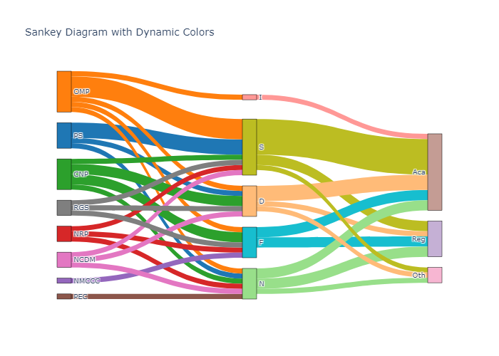

# Data Visualizations

## 1. Bar Graph

```python
import pandas as pd
import matplotlib.pyplot as plt

# Read data
bar_data = pd.read_csv('bar_assignment.csv')
bar_data['COUNT'] = bar_data['COUNT'].map({1: 'Yes', 0: 'No'})
bar_grouped = bar_data.groupby(['LABEL', 'COUNT']).size().unstack(fill_value=0)

# Plot
bar_grouped.plot(kind='barh', stacked=True)
plt.xlabel('Count')
plt.ylabel('Label')
plt.title('Horizontal Stacked Bar Chart')
plt.savefig('bar_chart.png')
plt.show()

```

### Output:


## 2. Sankey Diagram

```python
import pandas as pd
import plotly.graph_objects as go

# Read data
sankey_data = pd.read_csv('sankey_assignment.csv')
df_prep = sankey_data.melt(id_vars=['LABEL'], var_name='source', value_name='value')
df_prep.rename(columns={'LABEL': 'target'}, inplace=True)
df_prep = df_prep[['source', 'target', 'value']]

# Split the data into layers
df_temp1 = df_prep[:40]
df_temp2 = df_prep[40:]
df_temp2 = df_temp2[['target', 'source', 'value']]
df_temp2.rename(columns={'target': 'source', 'source': 'target'}, inplace=True)

# Combine the layers
links = pd.concat([df_temp1, df_temp2], axis=0)
unique_source_target = list(pd.unique(links[['source', 'target']].values.ravel('K')))
mapping_dict = {k: v for v, k in enumerate(unique_source_target)}
links['source'] = links['source'].map(mapping_dict)
links['target'] = links['target'].map(mapping_dict)

# Convert to dictionary for Plotly
links_dict = links.to_dict(orient='list')

# Define colors
hex_colors = ["#1f77b4", "#ff7f0e", "#2ca02c", "#d62728", "#9467bd", "#8c564b", "#e377c2"]
node_colors = {node: hex_colors[i % len(hex_colors)] for i, node in enumerate(unique_source_target)}

# Plot
fig = go.Figure(data=[go.Sankey(
   node=dict(
        pad=15, thickness=20, line=dict(color='black', width=0.5),
        label=unique_source_target,
        color=[node_colors[node] for node in unique_source_target],
   ),
   link=dict(
        source=links_dict['source'],
        target=links_dict['target'],
        value=links_dict['value'],
        color=[node_colors[unique_source_target[src]] for src in links_dict['source']]
   )
)])

fig.update_layout(title_text="Sankey Diagram with Dynamic Colors", font_size=10)
fig.write_image('sankey_diagram.png')
fig.show()

```

### Output:


## 3. Network Graph

```python
import pandas as pd
import networkx as nx
import matplotlib.pyplot as plt

# Read data
network_data = pd.read_csv('networks_assignment.csv')

# Create graph
G = nx.Graph()
colors = {'D': 'blue', 'F': 'blue', 'I': 'blue', 'N': 'blue', 'S': 'blue', 'USA': 'green'}
for node, color in colors.items():
    G.add_node(node, color=color)

# Add edges
for index, row in network_data.iterrows():
    label = row['LABELS']
    for col in network_data.columns[1:]:
        if row[col] > 0:
            G.add_edge(label, col, weight=row[col])

# Positions
pos = {'D': (0, 0.5), 'F': (-0.5, -0.3), 'I': (0.5, -0.3), 'N': (-0.3, -0.8), 'S': (0.3, -0.8)}

# Plot
node_colors = [colors.get(node, 'gray') for node in G.nodes()]
plt.figure(figsize=(10, 8))
nx.draw(G, pos, node_color=node_colors, with_labels=True, edge_color='gray', node_size=800, font_size=8, width=1)
plt.title("Network Graph")
plt.savefig('network_graph.png')
plt.show()

```

### Output:


## 4. Collated Image

```python
from PIL import Image

# Open images
bar_img = Image.open("bar_chart.png")
sankey_img = Image.open("sankey_diagram.png")
network_img = Image.open("network_graph.png")

# Resize images
network_width = int(network_img.width * 1.5)
network_height = int(network_img.height * 1.5)
network_img = network_img.resize((network_width, network_height))

bar_width = network_width // 3
bar_height = network_height // 3
bar_img = bar_img.resize((bar_width, bar_height))

sankey_width = bar_width
sankey_height = network_height - bar_height
sankey_img = sankey_img.resize((sankey_width, sankey_height))

# Collate images
collated_width = network_width + bar_width
collated_height = network_height
collated_img = Image.new('RGB', (collated_width, collated_height), "white")

collated_img.paste(bar_img, (0, 0))
collated_img.paste(sankey_img, (0, bar_img.height))
collated_img.paste(network_img, (bar_width, 0))

collated_img.save("collated_graphs.png")
collated_img.show()

```

### Output:


